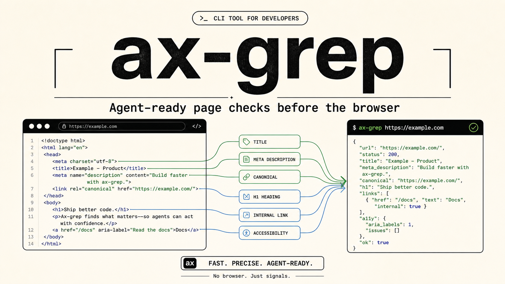

<div align="center">

# ax-grep



[](https://www.npmjs.com/package/ax-grep)
[](./tests)
[](./LICENSE)

Compact semantic trees and agent-ready page checks from HTML, URLs, WebViews,
and live browser pages.

</div>

Core features:

- readable semantic trees from URLs, files, stdin, or captured browser HTML
- compact `--agent` JSON for search, page checks, and browser handoff loops

## 1. Install The CLI Skill

```sh
curl -fsSL https://raw.githubusercontent.com/hmmhmmhm/ax-grep/main/skills.sh | sh
```

This installs the Codex skill prompt only. Restart Codex if the new skill is
not listed immediately.

## Try The CLI

```sh
npx --yes ax-grep@latest https://example.com --agent-brief
```

If you installed the binary globally, use `ax-grep` directly.
Agents should read `agent.executor`, `agent.handoff`, `agent.readTargets`,
`pageCheck`, and `verification` first. Open a browser only when the handoff
fields say static HTML is not enough.

## 2. Use From A Server

```sh
npm install ax-grep
```

```ts
import { extract, formatSemanticTreeText } from "ax-grep";

const html = await fetch("https://example.com").then((r) => r.text());
const tree = extract(html);
const promptText = formatSemanticTreeText(tree);
```

`ax-grep` is ESM-only and requires Node 18 or newer. CommonJS services can use
`const { extract } = await import("ax-grep")`.

## 3. Use In WebViews Or Pages

```ts
import { createExtractorScript } from "ax-grep";

const script = createExtractorScript({ format: "text" });
const text = await page.evaluate(script);
// iOS/Android WebView: evaluateJavaScript(script) returns the same text value.
```

## Docs

- [Documentation index](./docs/README.md)
- [CLI skill prompt](./skills/ax-grep-cli/SKILL.md)
- [Current progress](./docs/progress.md)
- [Feature overview](./docs/features.md)
- [CLI and agent mode](./docs/cli-agent.md)
- [Agent handoff loop](./docs/agent-handoff.md)
- [Library API](./docs/library-api.md)
