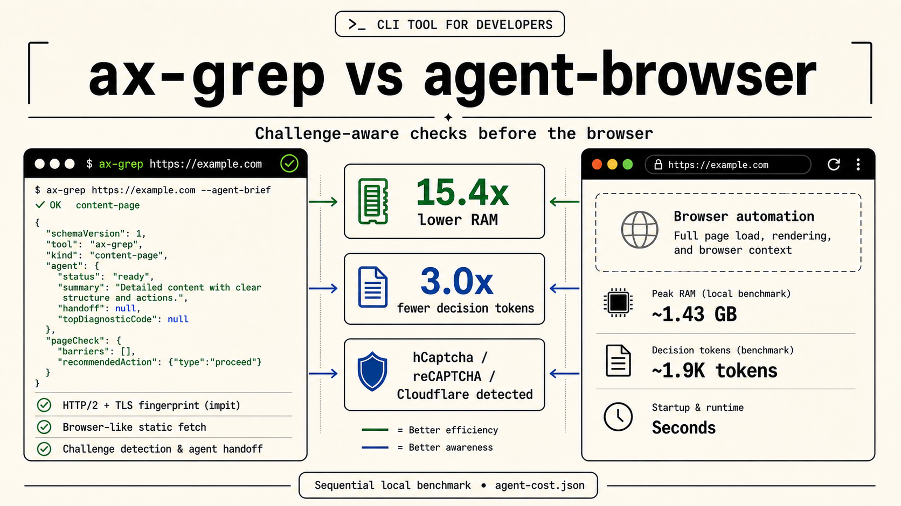

<div align="center">

# ax-grep

[](https://www.npmjs.com/package/ax-grep)
[](./tests)
[](./LICENSE)




Compact semantic trees and agent-ready page checks from HTML, URLs, WebViews, and live browser pages.
It approximates the accessibility tree browsers expose, but can do it from
static HTML before launching browser automation.

The CLI defaults to `impit` for browser-like HTTP/2/TLS static fetches, detects
hCaptcha, reCAPTCHA, and Cloudflare challenge markers, then tells agents when a
browser is actually needed. In the local benchmark, the decision handoff used
15.4x less peak RAM on average and 3.0x fewer decision tokens on the content
fixture than `agent-browser snapshot`.

</div>

## 1. Try With A Prompt

Paste this into a Codex session or subagent prompt before opening a browser:

```md
Before opening a browser, inspect pages with ax-grep when possible.

Run:
npx --yes ax-grep@latest <url> --agent-brief

Read agent.executor, agent.handoff, agent.readTargets, pageCheck, and
verification first. Open a browser only when the payload says static HTML is
not enough.
```

## 2. Install The CLI Skill

```sh
curl -fsSL https://raw.githubusercontent.com/hmmhmmhm/ax-grep/main/skills.sh | sh
```

This installs the Codex skill prompt only. Restart Codex if the new skill is not listed immediately.

## 3. Try The CLI

```sh
npx --yes ax-grep@latest https://example.com --agent-brief
```

If you installed the binary globally, use `ax-grep` directly.
Agents should read `agent.executor`, `agent.handoff`, `agent.readTargets`,
`pageCheck`, and `verification` first. Open a browser only when the handoff
fields say static HTML is not enough.

## 4. Use From A Server

Use this inside agent services built with Codex SDK, OpenRouter, or similar
LLM routing stacks to turn fetched HTML into compact source evidence before
spending tokens or memory on browser automation.

```sh
npm install ax-grep
```

```ts
import { extract, formatSemanticTreeText } from "ax-grep";

const html = await fetch("https://example.com").then((r) => r.text());
const tree = extract(html);
const promptText = formatSemanticTreeText(tree);
```

`ax-grep` is ESM-only and requires Node 18 or newer. CommonJS services can use `const { extract } = await import("ax-grep")`.

## 5. Use In WebViews Or Pages

In mobile apps, WebViews, and in-page agents, inject the extractor to create an
accessibility-style structure immediately from the current page. It is useful
for local sLLM web search, local web parsing, and instant agent-ready page
summaries without leaving the app.

```ts
import { createExtractorScript } from "ax-grep";

const script = createExtractorScript({ format: "text" });
const text = await page.evaluate(script);
// iOS/Android WebView: evaluateJavaScript(script) returns the same text value.
```

## Docs
- [Documentation index](./docs/README.md)
- [CLI skill prompt](./skills/ax-grep-cli/SKILL.md)
- [CLI and agent mode](./docs/cli-agent.md)
- [Agent handoff loop](./docs/agent-handoff.md)
- [Benchmarks](./docs/benchmarks.md)
- [Library API](./docs/library-api.md)
